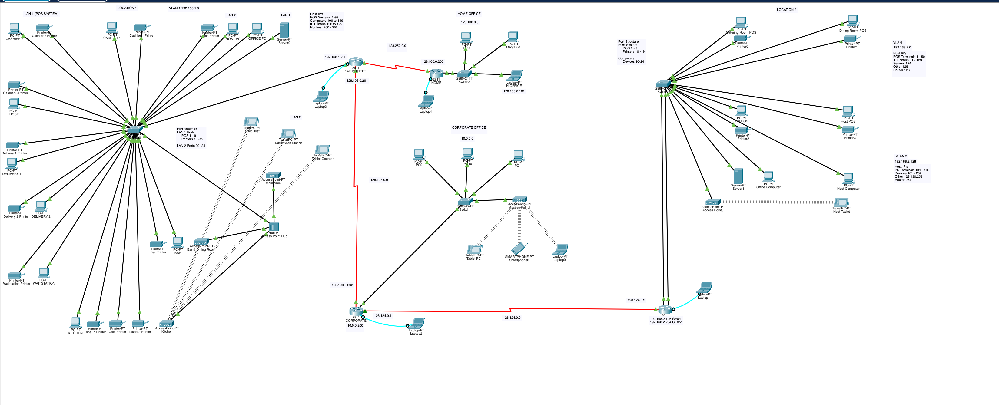

# Multilocation Restaurant Group Corp — Network Design

A four-site enterprise network designed and built in **Cisco Packet Tracer** for IT 220 (Business Data Communications). The design connects two restaurant locations, a home office, and a corporate office into a single routed network using **OSPF**, with **VLAN segmentation** isolating point-of-sale traffic from staff and guest access.

> **Author:** Christos Paloubis · **Course:** IT 220 — Business Data Communications · **Term:** Fall 2024

---

## Overview

Multilocation Restaurant Group Corp. is a fictitious hospitality company operating two restaurants plus a home office and a corporate administrative hub. The network was designed to be **scalable, segmented, and secure**, with each restaurant separating its POS network from the computers and Wi-Fi used by staff and guests. The home office provides centralized management, and the corporate office serves as the administrative core linking every site together.

The build spans **Class A, B, and C** addressing, **static and dynamic (OSPF) routing**, **VLANs**, **wireless access**, and **subnetting** to optimize address allocation across the four LANs and three WAN links.

---

## Topology

Four Cisco 2911 routers connect the sites over serial WAN links, each site anchored by a 2960-24TT switch with wired and wireless access below it.

---

## Site & Addressing Plan

| Site | Role | Network | Class | Segmentation |
|---|---|---|---|---|
| **14th Street** (Location 1) | Restaurant | `192.168.1.0` | C | POS + staff/guest wireless |
| **Columbus Ave** (Location 2) | Restaurant | `192.168.2.0` / `192.168.2.128` | C | VLAN 1 (POS) / VLAN 2 (staff) |
| **Home Office** | Central management | `128.100.0.0` | B | — |
| **Corporate Office** | Administrative hub | `10.0.0.0` | A | — |

### WAN Links (OSPF)

| Link | Network | Endpoints |
|---|---|---|
| 14th Street ↔ Home Office | `128.252.0.0` | 14th St `.200` ↔ Home `.200` |
| 14th Street ↔ Corporate | `128.108.0.0` | `.201` ↔ `.202` |
| Corporate ↔ Columbus Ave | `128.124.0.0` | `.1` ↔ `.2` |

### Host Addressing Scheme

**14th Street (`192.168.1.0`)**
- POS systems: `.1`–`.99`
- Computers: `.100`–`.149`
- IP printers: `.150`–`.199`
- Routers: `.200`–`.255`

**Columbus Ave — VLAN 1 (`192.168.2.0`)**
- POS terminals: `.1`–`.50`
- IP printers: `.51`–`.123`
- Servers: `.124` · Other: `.125` · Router: `.126`

**Columbus Ave — VLAN 2 (`192.168.2.128`)**
- PC terminals: `.131`–`.180`
- Devices: `.181`–`.252`
- Other: `.129`, `.130`, `.253` · Router: `.254`

---

## Device Inventory

| Site | Devices |
|---|---|
| **14th Street** | 8 POS terminals, 1 POS server, 2 computers, 11 IP printers, 3 wireless tablets, 2 access points |
| **Columbus Ave** | 4 POS terminals, 1 POS server, 2 computers, 4 IP printers, 1 access point, 1 wireless tablet |
| **Home Office** | 2 computers, 1 laptop |
| **Corporate Office** | 3 POS terminals, 2 tablets, 1 smartphone |

**Core equipment:** Cisco 2911 routers (×4), 2960-24TT switches, PT hubs and access points, and 40+ end devices across the four LANs.

---

## Key Design Features

- **OSPF dynamic routing** across all four sites for resilient, self-adjusting paths
- **VLAN segmentation** isolating POS/payment traffic from staff and guest networks
- **Mixed-class addressing** (A/B/C) demonstrating subnetting and address planning
- **Wireless access** at every restaurant location for tablets and mobile devices
- **Centralized management** through the home office, with corporate as the administrative hub

---

## Repository Contents

| Path | Description |
|---|---|
| `IT_220_Final_Project.pkt` | The Cisco Packet Tracer file — open to explore the live topology |
| `docs/` | Project write-up, cover sheet, and abstract (PDF) |
| `screenshots/topology.png` | Full topology diagram |

---

## How to Open

1. Install [Cisco Packet Tracer](https://www.netacad.com/courses/packet-tracer) (free with a Cisco Networking Academy account).
2. Download `IT_220_Final_Project.pkt` from this repo.
3. Open it in Packet Tracer to inspect device configs, routing tables, and connectivity.

---

*Built as the final project for IT 220 — Business Data Communications, Fall 2024.*
